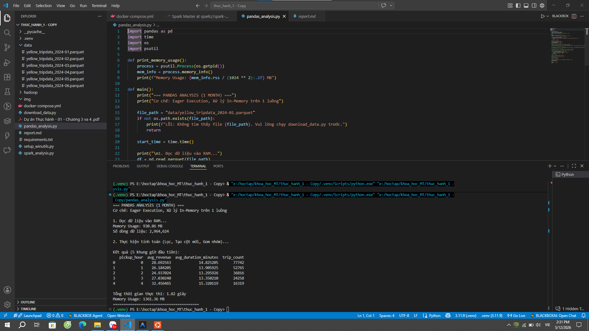
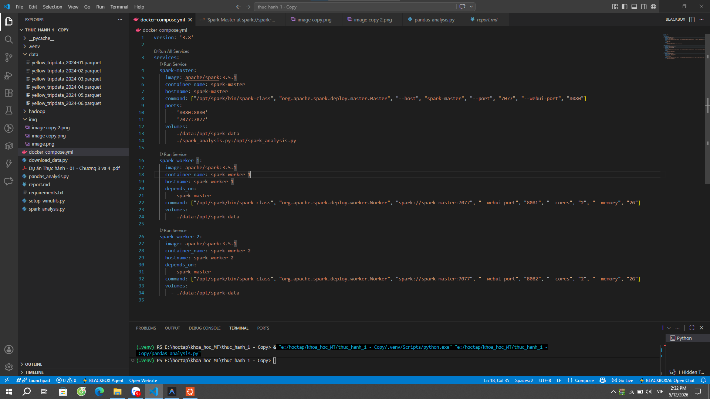
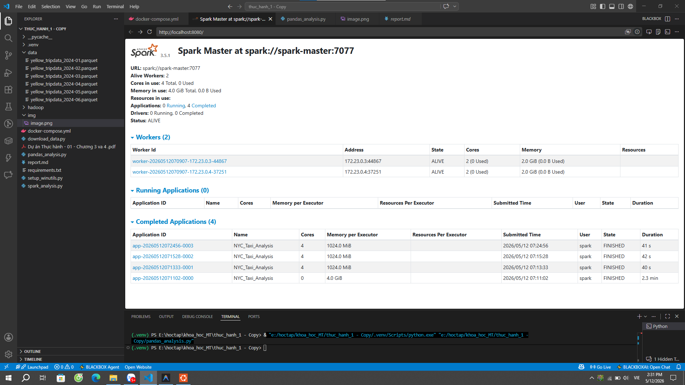
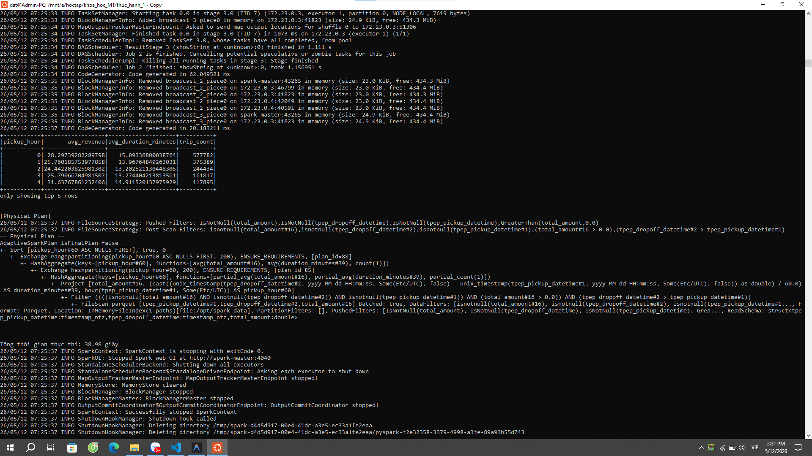

# Báo cáo quá trình thực hành

## 1. Mục tiêu bài thực hành
Bài thực hành tập trung so sánh hiệu năng và kiến trúc giữa Pandas và PySpark trên dữ liệu NYC Taxi.

Các mục tiêu chính:
- Hiểu sự khác nhau giữa xử lý in-memory trên 1 máy (Pandas) và xử lý phân tán (PySpark).
- Thực hành dựng cụm Spark Standalone bằng Docker gồm 1 Master và 2 Worker.
- Chạy pipeline tính toán doanh thu trung bình và thời gian di chuyển theo khung giờ.

## 2. Môi trường và dữ liệu
- Workspace: thuc_hanh_1 
- Docker Compose: 1 spark-master, 2 spark-worker
- Dữ liệu: Yellow Taxi Parquet (thư mục data)

## 3. Quá trình thực hiện
### Bước 1: Chuẩn bị và chỉnh cấu hình Docker
- Cập nhật image Spark sang apache/spark:3.5.1.
- Cấu hình master và worker chạy đúng spark://spark-master:7077.
- Xử lý xung đột cổng và dọn container cũ để cụm khởi động ổn định.

### Bước 2: Khởi chạy cụm Spark
- Chạy docker-compose up -d.
- Kiểm tra Spark Master UI hiển thị đủ 2 worker ở trạng thái ALIVE.

### Bước 3: Chạy PySpark và xử lý lỗi tài nguyên
- Ban đầu job bị WAITING do cấu hình tài nguyên chưa phù hợp.
- Điều chỉnh executor memory xuống 1G, executor cores phù hợp với cụm 2 worker.
- Job chuyển sang RUNNING và FINISHED.

### Bước 4: Chạy Pandas
- Chạy pandas_analysis.py trong môi trường .venv.
- Bổ sung thiếu thư viện psutil vào requirements và cài lại.
- Script Pandas chạy thành công, in kết quả và thống kê bộ nhớ.

## 4. Các lỗi chính và cách khắc phục
- Lỗi kéo image bitnami/spark không tồn tại.
  - Khắc phục: chuyển sang apache/spark:3.5.1.
- Lỗi bind port đã được sử dụng.
  - Khắc phục: chỉnh lại mapping cổng hoặc bỏ publish cổng worker.
- Lỗi chạy PySpark từ Python local bị UnknownHostException spark-master.
  - Khắc phục: chạy spark-submit bên trong container spark-master.
- Lỗi thiếu psutil khi chạy Pandas.
  - Khắc phục: cài psutil vào môi trường .venv.

## 5. Kết quả đạt được
- Cụm Spark hoạt động ổn định với 2 worker.
- Job PySpark chạy phân tán, hoàn tất thành công và có lịch sử Completed Applications.
- Pandas chạy thành công trên dữ liệu 1 tháng và xuất kết quả thống kê theo giờ.
- Hoàn thành mục tiêu so sánh cách thực thi giữa Pandas và PySpark.

## 6. Ảnh minh chứng
### 6.1. Kết quả chạy Pandas thành công trên terminal

### 6.2. Cấu hình docker-compose của cụm Spark

### 6.3. Spark Master UI sau khi cụm hoạt động

### 6.4. Kết quả chạy job PySpark trên terminal

## 7. Kết luận
Qua bài thực hành, có thể thấy:
- Pandas phù hợp dữ liệu vừa và nhỏ, thao tác nhanh trên 1 máy.
- PySpark phù hợp dữ liệu lớn, tận dụng cụm phân tán để mở rộng tài nguyên.
- Cấu hình tài nguyên Spark ảnh hưởng trực tiếp đến khả năng phân phối và thời gian xử lý.
